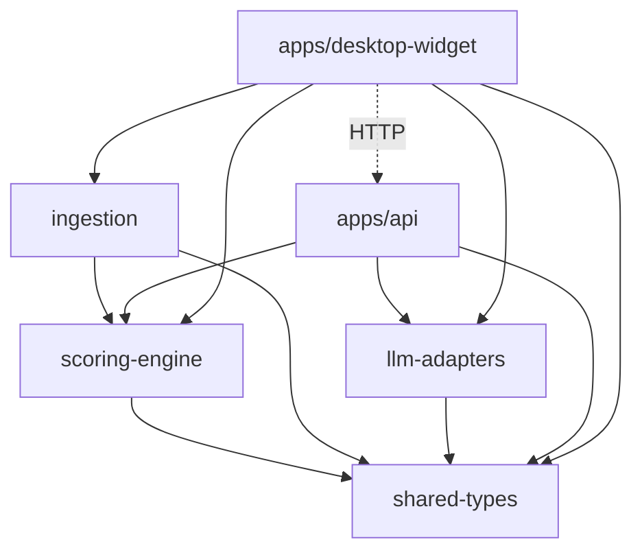
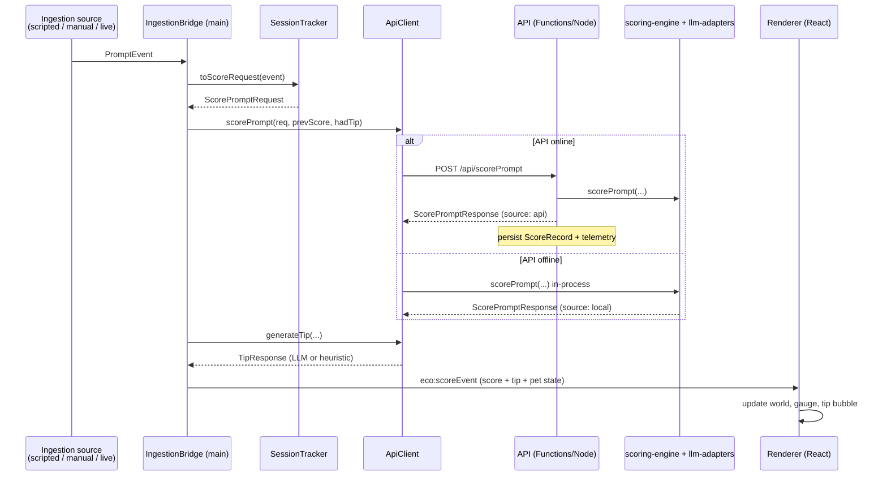

# Tokentama — Architecture & Connection Map

> **Audience:** engineering team picking up the codebase.
> **Purpose:** show what each piece is, where it lives, and how data flows between
> them. Pair this with [CLOUD_MVP_PLAN.md](CLOUD_MVP_PLAN.md) (how to take it to the
> cloud) and [TEAM_HANDOFF.md](TEAM_HANDOFF.md) (what's done and what's next).

---

## 1. One-paragraph mental model

A prompt "event" (typed by the user, replayed from a demo script, or read from a
live Copilot chat on disk) is **normalized** into a `PromptEvent`, **scored** by a
pure deterministic engine, **coached** by an LLM-or-heuristic tip generator, then
**pushed to the Electron UI**, which renders a Tamagotchi-style world whose health
reflects how efficient the prompt was. The same scoring/coaching logic can run
either **in-process inside the desktop app** (offline fallback) or **behind an HTTP
API** (the Azure Functions / local Node server). Everything is wired through small,
strongly-typed contracts.

---

## 2. Monorepo layout (npm workspaces)

| Path                      | Workspace                   | Role                                                                                        |
| ------------------------- | --------------------------- | ------------------------------------------------------------------------------------------- |
| `packages/shared-types`   | `@ecoprompt/shared-types`   | The data contracts every other package imports. No logic.                                   |
| `packages/scoring-engine` | `@ecoprompt/scoring-engine` | Pure, deterministic waste/efficiency scoring + pet-state machine.                           |
| `packages/ingestion`      | `@ecoprompt/ingestion`      | Turns raw inputs (manual / scripted / live Copilot files) into `PromptEvent`s.              |
| `packages/llm-adapters`   | `@ecoprompt/llm-adapters`   | Coaching tips + prompt rewrites (Azure OpenAI / Foundry / OpenAI, with heuristic fallback). |
| `apps/api`                | `@ecoprompt/api`            | The backend. Dual-mode: **local Node server** or **Azure Functions**.                       |
| `apps/desktop-widget`     | `@ecoprompt/desktop-widget` | Electron + React companion. Owns ingestion, talks to the API, renders the world.            |

**Build:** `npm run build` → `tsc --build` using TypeScript project references.
**Test:** `npm test` → `vitest run` (44 tests / 9 files).
**Widget dev:** `npm run widget:dev` → `electron-vite dev`.

Dependency direction (no cycles):

> Note: the widget depends on `scoring-engine` and `llm-adapters` **directly** so it
> can score offline, _and_ it calls `apps/api` over HTTP when the API is reachable.
> That dual path is the single most important thing to understand about this repo.

---

## 3. The core contracts (`shared-types`)

These are the nouns the whole system passes around. Read these files first.

| Type                                         | File                                          | What it is                                                                                                                                                                 |
| -------------------------------------------- | --------------------------------------------- | -------------------------------------------------------------------------------------------------------------------------------------------------------------------------- |
| `PromptEvent`                                | `packages/shared-types/src/PromptEvent.ts`    | One normalized turn: prompt text, response, tool calls, model, tokens, retry count, source (`transcript`/`chat-session`/`manual`/`scripted`). The unit ingestion produces. |
| `ScorePromptRequest` / `ScorePromptResponse` | `packages/shared-types/src/Score.ts`          | Scoring input/output: `overallScore`, `wasteScore`, 5 `subscores`, `petState`, `delta`, waste breakdown across 6 categories, reasons & improvements.                       |
| `TipRequest` / `TipResponse`                 | `packages/shared-types/src/Tip.ts`            | Coaching input/output: `shortTip`, `detailedTip`, `rewrittenPrompt`, `estimatedSavings`, `source`.                                                                         |
| `SessionSummary`                             | `packages/shared-types/src/SessionSummary.ts` | Aggregated session metrics (tokens, cost, retries, waste-by-category, estimated savings).                                                                                  |
| `PetWorldState`                              | `packages/shared-types/src/PetWorldState.ts`  | `thriving → healthy → concerned → critical → collapse → dead`.                                                                                                             |
| `TelemetryEvent`                             | `packages/shared-types/src/Telemetry.ts`      | Named analytics events (prompt_scored, tip_generated, pet_state_changed, …).                                                                                               |

**Waste categories** (weights): `redundantContext` 30%, `vagueness` 20%, `retryLoop`
20%, `toolOveruse` 15%, `verbosityMismatch` 10%, `ignoredCoaching` 5%.
**Subscores:** promptQuality, contextEfficiency, toolEfficiency, outputEfficiency,
learningAdoption.

---

## 4. Scoring engine (the deterministic core)

`packages/scoring-engine` — pure functions, no I/O, fully unit-tested.

- **`scorePrompt(req, { previousScore, hadPreviousTip })`** (`src/scorePrompt.ts`) is
  the entry point. It runs the detectors, computes the waste score, derives
  subscores, maps the score to a pet state, and computes the delta vs. the previous
  turn.
- **Detectors** (`src/heuristics/*`): six `Detector`s, each returning a severity
  (0..1) + reason + improvement: `redundantContext`, `vagueness`, `retryLoop`,
  `toolOveruse`, `verbosityMismatch`, `coachingAdoption`. `structuredPrompt` is a
  positive signal that _reduces_ effective vagueness.
- **`wasteScore.ts` / `subscores.ts`** (`src/calculators/`): weight + clamp detector
  output into the final numbers.
- **`petStateMachine.ts`** (`src/transitions/`): `scoreToState()` thresholds and
  recovery/transition tracking.
- **`tokenizer.ts` / `pricing.ts`** (`src/models/`): token estimation + per-model USD
  cost (pricing sourced from VS Code's `models.json`).
- **`similarity.ts`** (`src/text/`): cosine-like similarity used for retry/redundancy
  detection.

**Why it matters:** because this is pure and deterministic, it runs unchanged in the
browser, in Electron, in Node, or in a Function. It is the asset that should never be
duplicated.

---

## 5. Ingestion (where prompt events come from)

`packages/ingestion` exposes three **adapters** behind one interface
(`IngestionAdapter`: `start()`, `stop()`, `onPromptEvent(handler)`):

| Adapter                   | File                                      | Source                                                          | Availability                                |
| ------------------------- | ----------------------------------------- | --------------------------------------------------------------- | ------------------------------------------- |
| `ScriptedScenarioAdapter` | `src/adapters/ScriptedScenarioAdapter.ts` | Pre-baked `DEMO_SCRIPT` steps (`next`/`play`/`pause`/`reset`)   | Always — drives the demo arc                |
| `ManualEntryAdapter`      | `src/adapters/ManualEntryAdapter.ts`      | A prompt the user types/pastes in the widget                    | Always                                      |
| `TranscriptTailAdapter`   | `src/adapters/TranscriptTailAdapter.ts`   | **Live local Copilot chat files on disk** (chokidar file-watch) | Only if Copilot session files exist locally |

Supporting pieces:

- **`copilotPaths.ts` / `copilotReader.ts` / `transcriptParser.ts` /
  `chatSessionParser.ts`** read and merge VS Code Copilot's on-disk
  `transcripts/*.jsonl` + `chatSessions/*.jsonl` into `PromptEvent`s (real output
  token counts come from the chatSession). **This is the most local-bound part of the
  system** — see [CLOUD_MVP_PLAN.md](CLOUD_MVP_PLAN.md).
- **`sessionTracker.ts`** — `toScoreRequest()` converts a `PromptEvent` into a
  `ScorePromptRequest`, maintaining a rolling window of recent prompts for retry
  detection.
- **`promptEventFactory.ts`** — builds `PromptEvent`s (token estimation, model
  resolution, cost).
- **`usage/UsageMetricsProvider.ts`** — pluggable usage rollups (local / estimated /
  an `EnterpriseMetricsProvider` stub for Power BI).

---

## 6. LLM adapters (coaching)

`packages/llm-adapters`:

- **`coach.ts`** — `generateTip()`: tries the LLM if configured, **always** falls back
  to the heuristic coach (never throws).
- **`heuristicCoach.ts`** — deterministic per-category tips + a `heuristicRewrite()`
  that de-dupes sentences and adds format guidance. This is the zero-config default.
- **`llmCoach.ts`** — HTTP chat-completion client for `azure-openai`, `foundry`, or
  `openai`; parses a strict JSON response into a `TipResponse`.
- **`config.ts`** — `loadCoachConfig(env)` reads `ECO_LLM_*` env vars;
  `isCoachConfigured()` is true only when a provider + endpoint + key are present.

---

## 7. The API (`apps/api`) — dual deployment

The **same handlers** are exposed two ways:

|       | Local                                                      | Azure                                                                |
| ----- | ---------------------------------------------------------- | -------------------------------------------------------------------- |
| Entry | `src/server.ts` (`createApiServer()`, plain Node `http`)   | `src/index.ts` → registers `src/functions/*.ts` (Azure Functions v4) |
| Start | `npm run start` → `node dist/src/server.js` on port `7071` | `func start` / deployed Function App                                 |

Both wrap the shared logic in **`src/core/handlers.ts`**:

| Endpoint              | Method | Handler                | Does                                                                   |
| --------------------- | ------ | ---------------------- | ---------------------------------------------------------------------- |
| `/api/health`         | GET    | `handleHealth`         | Reports `{ status, storage, coachConfigured, telemetryConfigured }`    |
| `/api/scorePrompt`    | POST   | `handleScorePrompt`    | Scores via `scoring-engine`, persists a `ScoreRecord`, emits telemetry |
| `/api/generateTip`    | POST   | `handleGenerateTip`    | Coaches via `llm-adapters`                                             |
| `/api/sessionSummary` | POST   | `handleSessionSummary` | Aggregates a session (`core/summary.ts`)                               |

Backing services (swap via env vars):

- **`lib/storage.ts`** — `createScoreStore()` returns `TableScoreStore` (Azure Table
  Storage) when `ECO_STORAGE_CONNECTION_STRING` is set, otherwise `InMemoryScoreStore`.
- **`lib/telemetry.ts`** — sends to **Application Insights** when
  `APPLICATIONINSIGHTS_CONNECTION_STRING` is set; otherwise debug-logs or stays silent.

---

## 8. The desktop widget (`apps/desktop-widget`)

Electron, three layers:

- **Main process** (`src/main/index.ts`) — creates the frameless always-on-top
  window, the tray, registers IPC, and owns two services:
  - **`services/apiClient.ts`** — calls the API, and **transparently falls back** to
    the local `scoring-engine` + heuristic coach when the API is offline (1.5s
    timeout). Every result is tagged `source: 'api' | 'local'`.
  - **`services/ingestionBridge.ts`** — owns the active ingestion adapter, runs the
    score→coach pipeline per event, accumulates session metrics, and pushes
    `ScoreEvent`s to the renderer.
- **Preload** (`src/preload/index.ts`) — `contextBridge` exposes a typed `window.eco`
  API to the renderer (invoke methods + event listeners).
- **Renderer** (`src/renderer/src/*`) — React + Zustand. `App.tsx` subscribes to
  `window.eco.onScore` / `onStatus`; `WorldRenderer.tsx` draws the procedural world on
  a Canvas; `store.ts` holds smoothed health + history.

IPC surface (`src/shared/contracts.ts`): invoke channels (`eco:getStatus`,
`eco:setMode`, `eco:scriptedNext/Play/Pause/Reset`, `eco:submitManual`,
`eco:acceptRewrite`, `eco:getMetrics`, `eco:setWindowMode`, `eco:quit`) and push
channels (`eco:scoreEvent`, `eco:statusEvent`).

---

## 9. End-to-end flow (the path every turn takes)

**Three ingestion modes** feed the very same pipeline — only the left-most box
changes. The scripted mode is what powers the 1–3 minute demo arc
(`100 → trough 33 → recovery 95`).

---

## 10. Configuration cheat-sheet (all env vars)

| Variable                                                                                                                          | Read by                     | Effect                                                                               |
| --------------------------------------------------------------------------------------------------------------------------------- | --------------------------- | ------------------------------------------------------------------------------------ |
| `ECO_API_URL`                                                                                                                     | widget `apiClient.ts`       | API base URL (default `http://localhost:7071/api`). Point this at Azure to go cloud. |
| `ECO_API_PORT`                                                                                                                    | `apps/api/server.ts`        | Local server port (default 7071).                                                    |
| `ECO_STORAGE_CONNECTION_STRING`                                                                                                   | `apps/api/lib/storage.ts`   | Set → Azure Table Storage; unset → in-memory.                                        |
| `APPLICATIONINSIGHTS_CONNECTION_STRING`                                                                                           | `apps/api/lib/telemetry.ts` | Set → App Insights telemetry.                                                        |
| `ECO_LLM_PROVIDER` / `ECO_LLM_ENDPOINT` / `ECO_LLM_API_KEY` / `ECO_LLM_DEPLOYMENT` / `ECO_LLM_API_VERSION` / `ECO_LLM_TIMEOUT_MS` | `llm-adapters/config.ts`    | Configure the LLM coach. All unset → heuristic coach.                                |
| `ECO_COPILOT_WORKSPACE_STORAGE`                                                                                                   | `ingestion/copilotPaths.ts` | Override where live Copilot files are read from.                                     |

See [.env.example](../.env.example) and
[apps/api/local.settings.example.json](../apps/api/local.settings.example.json).

---

## 11. What's deviated from the design doc

- **Visual layer:** the design doc proposes **PixiJS**; the current build renders the
  world procedurally on a plain **Canvas** (`WorldRenderer.tsx`). Functionally
  equivalent for the demo; swap later if richer sprite art is needed.
- **Analytics:** the design doc proposes **Power BI**; today only telemetry events +
  `sessionSummary` aggregation exist. No dashboard yet (Epic 4 gap).
- **LLM:** "Foundry" in the doc; the adapter supports Foundry/Azure OpenAI/OpenAI but
  ships defaulting to the **heuristic** coach.
