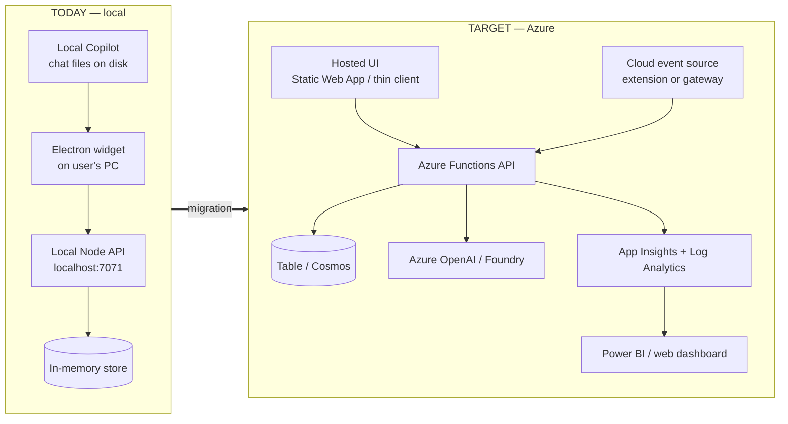

# Tokentama — Cloud MVP Plan

> **Goal:** take the project from "runs on my laptop" to a **true cloud MVP that does
> not run locally at all** — scoring, coaching, storage, telemetry, and the UI all
> hosted in Azure, usable by multiple people without cloning the repo.
>
> Read [ARCHITECTURE.md](ARCHITECTURE.md) first. This document is the gap analysis +
> work breakdown.

---

## 1. Where compute runs today vs. the cloud target



The good news: **most of the backend already exists in cloud-ready form.** The Azure
Functions handlers, the Table Storage adapter, the App Insights telemetry, the LLM
adapter, and the Bicep infra are all written. The work is (a) deploy + wire them, (b)
remove the local-only assumptions, and (c) replace the two things that are
fundamentally local: the **Electron shell** and the **on-disk Copilot ingestion**.

---

## 2. The local-only blockers (and how to remove each)

| #   | Local-only thing                  | Where                                                             | Why it blocks cloud                                      | Resolution                                                                                                                                                                   |
| --- | --------------------------------- | ----------------------------------------------------------------- | -------------------------------------------------------- | ---------------------------------------------------------------------------------------------------------------------------------------------------------------------------- |
| 1   | **In-memory score store**         | `apps/api/lib/storage.ts` (`InMemoryScoreStore`)                  | Data dies on restart, not shared                         | Set `ECO_STORAGE_CONNECTION_STRING` → `TableScoreStore` (already implemented). Optionally upgrade to Cosmos DB for richer queries.                                           |
| 2   | **Local Node server**             | `apps/api/server.ts`                                              | A process on localhost                                   | Deploy `apps/api/functions/*` to the **Azure Function App** (already authored). Stop using `server.ts` in production.                                                        |
| 3   | **Heuristic-only coach**          | `llm-adapters` default                                            | No real LLM coaching                                     | Deploy Azure OpenAI/Foundry, set `ECO_LLM_*` app settings.                                                                                                                   |
| 4   | **No telemetry sink**             | `apps/api/lib/telemetry.ts`                                       | Metrics go nowhere                                       | Set `APPLICATIONINSIGHTS_CONNECTION_STRING` (Bicep already provisions App Insights).                                                                                         |
| 5   | **On-disk Copilot ingestion**     | `packages/ingestion` `TranscriptTailAdapter` + `copilot*` readers | Reads files on the user's PC — impossible from the cloud | Replace the _source_, not the pipeline: a **VS Code extension / browser extension / IDE hook** captures each turn and `POST`s a `PromptEvent` to the cloud API. (See §4.)    |
| 6   | **Electron desktop shell**        | `apps/desktop-widget/src/main`                                    | A native app installed per machine                       | For a pure-cloud MVP, host the **renderer as a web app** (Static Web App) that calls the API over HTTPS. Keep Electron as an optional "native overlay" skin later. (See §3.) |
| 7   | **No authentication**             | Functions use `authLevel: 'function'` keys                        | Can't safely expose multi-user                           | Add **Entra ID (Easy Auth)** on the Function App / SWA; carry `userId` from the token, not the client.                                                                       |
| 8   | **CORS `*` + open function keys** | `infra/bicep/main.bicep`, function `authLevel`                    | Demo-grade security                                      | Lock CORS to the UI origin; move secrets to **Key Vault**; use Managed Identity for storage/OpenAI.                                                                          |
| 9   | **No analytics dashboard**        | — (Epic 4)                                                        | Success metrics can't be shown                           | Build **Power BI** over App Insights/Table, or a small web dashboard reading `sessionSummary`.                                                                               |

---

## 3. Making the UI cloud-hosted (no local install)

The renderer (`apps/desktop-widget/src/renderer`) is plain **React + Zustand** and is
already decoupled from Electron behind the `window.eco` contract. To host it:

1. **Introduce a transport seam.** Today the renderer only talks to the main process
   via `window.eco` (IPC). Define the same interface backed by **HTTP fetch** to the
   cloud API. Concretely: extract an `EcoClient` interface; provide two
   implementations — `IpcEcoClient` (existing) and `HttpEcoClient` (new, calls
   `/api/*`).
2. **Move ingestion-mode + metrics state** that currently lives in `IngestionBridge`
   (main process) into either the API or the web client. For the web MVP, **scripted**
   and **manual** modes are enough — both are pure and need no disk access.
3. **Host** the built renderer as an **Azure Static Web App** (or App Service). SWA
   gives you Entra auth + a managed `/api` proxy to the Functions for free.
4. Keep the Electron app as a **thin shell** that loads the same web bundle — so you
   maintain one UI, not two.

> Minimum for "does not run locally": ship the **web client + scripted/manual modes**.
> "Live Copilot" ingestion becomes an optional add-on via §4.

---

## 4. Replacing live ingestion for the cloud

The on-disk reader can never run in the cloud. Three options, cheapest first:

- **A. Manual/paste mode only (MVP).** Users paste prompts into the hosted UI. Zero
  new infra. Good enough to demonstrate scoring + coaching end-to-end.
- **B. Browser/VS Code extension (recommended next).** A small extension captures each
  Copilot/chat turn locally and `POST`s a `PromptEvent` to `/api/scorePrompt`. Reuses
  the existing `PromptEvent` contract and `promptEventFactory`. The heavy lifting
  (parsing/merging) stays client-side; the cloud only receives clean events.
- **C. AI-gateway integration (enterprise).** Put **Azure API Management** in front of
  the model endpoints, emit token/usage logs, and feed them to the API. This is the
  "governance" story in the design doc and the path to org-wide rollout.

All three converge on the same cloud endpoint, so the scoring/coaching backend doesn't
change.

---

## 5. What's already cloud-ready (reuse, don't rebuild)

- ✅ **Azure Functions handlers** — `apps/api/src/functions/{scorePrompt,generateTip,sessionSummary,health}.ts`
- ✅ **Bicep infra** — `infra/bicep/main.bicep` provisions Storage + `scores` table,
  Log Analytics, App Insights, a Consumption Function App, and _optionally_ Azure
  OpenAI. Wires `ECO_STORAGE_CONNECTION_STRING`, `APPLICATIONINSIGHTS_CONNECTION_STRING`,
  `FUNCTIONS_WORKER_RUNTIME=node`.
- ✅ **Table Storage adapter** — `TableScoreStore` in `lib/storage.ts`.
- ✅ **App Insights telemetry** — `lib/telemetry.ts`.
- ✅ **LLM adapter** — Azure OpenAI / Foundry / OpenAI in `llm-adapters`.
- ✅ **Deploy guide** — [azure-deploy.md](azure-deploy.md).

---

## 6. Step-by-step: deploy the backend today

This gets the **API** fully in Azure (UI migration is §3). From the design's existing
infra:

```bash
# 1. Provision
az group create -n eco-prompt-guardians -l eastus
az deployment group create -g eco-prompt-guardians \
  -f infra/bicep/main.bicep -p infra/bicep/main.parameters.json
# add -p deployAzureOpenAI=true to also stand up the LLM coach

# 2. Build + deploy the functions
npm run build
cd apps/api
func azure functionapp publish <functionAppName>

# 3. (If you deployed OpenAI) wire the coach
az functionapp config appsettings set -g eco-prompt-guardians -n <functionAppName> --settings \
  ECO_LLM_PROVIDER=azure-openai \
  ECO_LLM_ENDPOINT=https://<your-openai>.openai.azure.com \
  ECO_LLM_DEPLOYMENT=gpt-4o-mini \
  ECO_LLM_API_KEY=<key>

# 4. Point any client at the cloud
#    ECO_API_URL=https://<functionAppHostname>/api
```

Storage + telemetry are wired by Bicep automatically, so after step 2 the API is
already persisting to Table Storage and emitting to App Insights — **no in-memory, no
localhost.**

---

## 7. Hardening checklist before "real" MVP

- [ ] **Auth:** Entra ID (Easy Auth) on Function App + Static Web App; derive `userId`
      from the validated token, never from the request body.
- [ ] **Secrets:** move `ECO_LLM_API_KEY` and connection strings to **Key Vault**;
      use **Managed Identity** for Storage + OpenAI instead of keys.
- [ ] **CORS:** replace `allowedOrigins: ['*']` in `main.bicep` with the UI origin.
- [ ] **Function auth level:** keep `scorePrompt`/`generateTip`/`sessionSummary`
      non-anonymous; front them with the SWA managed API or APIM.
- [ ] **Rate limiting / quotas:** APIM or Functions throttling to protect the LLM spend.
- [ ] **Data model:** decide Table Storage vs. Cosmos DB once query/leaderboard needs
      are known (Epic 4).
- [ ] **CI/CD:** extend `.github/workflows/ci.yml` to build + deploy the Function App
      and Static Web App on merge to `main`.
- [ ] **Cost guardrails:** budget alerts; pick a small/cheap model (`gpt-4o-mini`).

---

## 8. Recommended sequencing

| Phase                     | Outcome                                                        | Work                                  |
| ------------------------- | -------------------------------------------------------------- | ------------------------------------- |
| **P0 — Backend in cloud** | API serves from Azure with persistent storage + telemetry      | §6 steps 1–2 (infra + `func publish`) |
| **P1 — LLM coaching**     | Real tips/rewrites from Azure OpenAI                           | §6 step 3                             |
| **P2 — Hosted UI**        | Web client (scripted + manual) on Static Web App, no local app | §3                                    |
| **P3 — Auth + hardening** | Multi-user safe                                                | §7                                    |
| **P4 — Live ingestion**   | Real prompt capture via extension                              | §4 option B                           |
| **P5 — Analytics**        | Power BI / dashboard over telemetry (Epic 4)                   | new work                              |

P0–P2 is the smallest path to "a true MVP that does not run locally at all."
